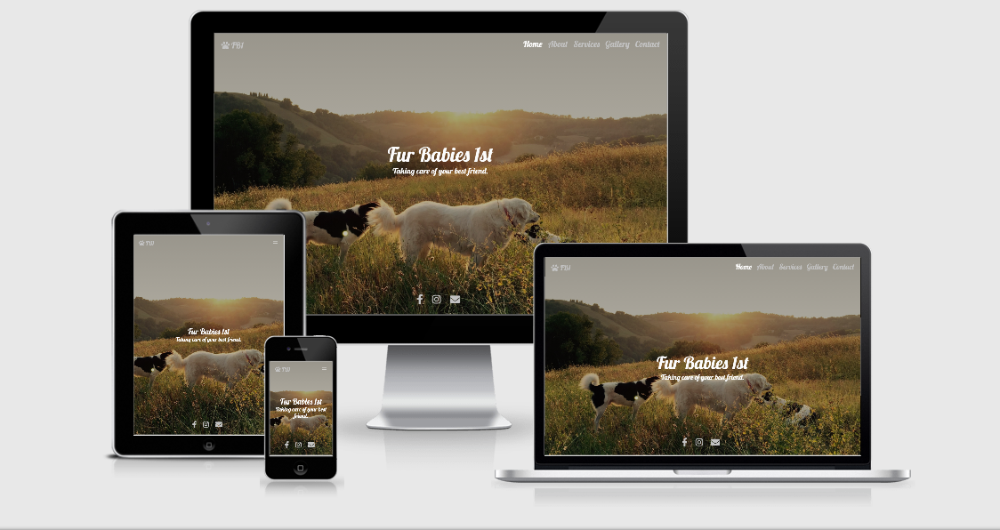

This is a screenshot from [Am I Responsive](http://ami.responsivedesign.is/)
# Fur Babies 1st

This website is for a Dog walking business to attract new clients and showcase the company's services. It will also be possible for potential clients to be able to contact the owner
and also be able to see their locale.
 
## User Experience UX

### User Requirements

- As a **User** I want to be able to easily understand what the website is for.
- As a **User** I want to be able to easily navigate the website.
- As a **User** I want to easily find services and prices.
- As a **User** i want to be able to find contact details.
- As a **User** i want to see location details to see if the service is available.

### Owners Requirements

- As an **Owner** I want the home page to immediately tell the User what the site is for.
- As an **Owner** I want the User to be able to easily navigate the site via navigation links.
- As an **Owner** I want to be able to advertise my services and prices.
- As an **Owner** I want potential clients to be able to easily contact me.

## Design

I did the design for this website using Balsamiq to create the wireframes. I have created wireframes for desktop, tablet and mobile

|                                                      Home                                                      	|                                                   About                                                   	|                                                   Services                                                   	|                                                   Gallery                                                   	|                                                   Contact                                                   	|
|:--------------------------------------------------------------------------------------------------------------:	|:---------------------------------------------------------------------------------------------------------:	|:------------------------------------------------------------------------------------------------------------:	|:-----------------------------------------------------------------------------------------------------------:	|:-----------------------------------------------------------------------------------------------------------:	|
| [Desktop](https://github.com/horizons83/Fur-Babies-1st/blob/master/assets/Wireframes/FB1%20Home%20desktop.pdf) 	| [Desktop](https://github.com/horizons83/Fur-Babies-1st/blob/master/assets/Wireframes/About%20desktop.pdf) 	| [Desktop](https://github.com/horizons83/Fur-Babies-1st/blob/master/assets/Wireframes/Services%20desktop.pdf) 	| [Desktop](https://github.com/horizons83/Fur-Babies-1st/blob/master/assets/Wireframes/Gallery%20desktop.pdf) 	| [Desktop](https://github.com/horizons83/Fur-Babies-1st/blob/master/assets/Wireframes/Contact%20desktop.pdf) 	|
|  [Tablet](https://github.com/horizons83/Fur-Babies-1st/blob/master/assets/Wireframes/FB1%20Home%20tablet.pdf)  	|  [Tablet](https://github.com/horizons83/Fur-Babies-1st/blob/master/assets/Wireframes/About%20tablet.pdf)  	|  [Tablet](https://github.com/horizons83/Fur-Babies-1st/blob/master/assets/Wireframes/Services%20tablet.pdf)  	|  [Tablet](https://github.com/horizons83/Fur-Babies-1st/blob/master/assets/Wireframes/Gallery%20tablet.pdf)  	|  [Tablet](https://github.com/horizons83/Fur-Babies-1st/blob/master/assets/Wireframes/Contact%20tablet.pdf)  	|
|  [Mobile](https://github.com/horizons83/Fur-Babies-1st/blob/master/assets/Wireframes/FB1%20Home%20mobile.pdf)  	|  [Mobile](https://github.com/horizons83/Fur-Babies-1st/blob/master/assets/Wireframes/About%20mobile.pdf)  	|  [Mobile](https://github.com/horizons83/Fur-Babies-1st/blob/master/assets/Wireframes/Services%20mobile.pdf)  	|  [Mobile](https://github.com/horizons83/Fur-Babies-1st/blob/master/assets/Wireframes/Gallery%20mobile.pdf)  	|  [Mobile](https://github.com/horizons83/Fur-Babies-1st/blob/master/assets/Wireframes/Contact%20mobile.pdf)  	|
 

I wanted to keep the design simple and easy to navigate so potential clients can find the information they want easily.
I wanted to create an about modal that was accessible from every page so clients could get some background infomation 
without coming away from other info that may be after. The about model would also help by lowering the amount of pages on the site.

### Fonts

I have used fonts from [google fonts](https://fonts.google.com/) I selected Lobster and Roboto as they were a suggested pair and so
complement each other. I have used "Lobster" for the menu and main headings then "Roboto" for paragraphs making it easier on the eye
to read text sections.

### Colour Scheme
I wanted to keep the colour scheme soft to the eye so used a mixture of off white and soft grey colours.
I have created a palette using [Coolors](https://coolors.co/) and it is displayed below.

## Features

### Features Currently Implemented

- The website is responsive.
- Design is soft and easy on the eye.
- The About modal is accessiblefrom all pages.
- Easy to follow navbar.
- Gallery page has images that open into a modal slideshow.
- Contact page has contact and location information including a locations covered map, Also there is a contact
  form that the user can fill out to arrange booking or ask a question.
- Social links are included on every page.

### Features Left to Implement
- Live calender and abilty to book sessions through site.
- Ability to pay through website via card/Paypal.
- Possible login page and ability to track walks live.

## Technologies Used

### Languages

- [HTML5](https://developer.mozilla.org/en-US/docs/Web/Guide/HTML/HTML5)
- [CSS3](https://developer.mozilla.org/en-US/docs/Web/CSS)

### Frameworks, Libraries and Programs

* [Balsamic](https://balsamiq.com/)
   * Balsamic was used to create the wireframes for the project during the design stage.
 
* [Bootstrap V4.5](https://getbootstrap.com/)
   * I used bootstrap to give the site a responsive layout and the ability to add a Nav and a Modal to the about and gallery pages.

* [Fontawsome V5](https://fontawesome.com/)
   * I used fontawsome to provide icons for Nav logo, Modal buttons and social media icons.

* [Google Fonts](https://fonts.google.com/)
   * Google fonts was used to provide Lobster and Roboto fonts for the site.
 
* [GitPod](https://www.gitpod.io/)
   * GitPod is the online IDE used to code the project.
 
* [Git](https://git-scm.com/)
   * Git was used for version control to commit and push from GitPod to GitHub.
 
* [GitHub](https://github.com/)
   * GitHub is the repository used to store the project.

 
  

## Testing

I used the WC3 HTML validator and the WC3 CSS validator to test every page of the website to check that there were no errors present.
below are the results of the checks.

* [WC3 HTML Validator](https://validator.w3.org/)
   * [index.html](https://validator.w3.org/nu/?doc=https%3A%2F%2Fhorizons83.github.io%2FFur-Babies-1st%2Findex.html) No errors or warnings to show.
   * [services.html](https://validator.w3.org/nu/?doc=https%3A%2F%2Fhorizons83.github.io%2FFur-Babies-1st%2Fservices.html) No errors but does show warning for using h1 more than once during pricing cards.
   * [gallery.html](https://validator.w3.org/nu/?doc=https%3A%2F%2Fhorizons83.github.io%2FFur-Babies-1st%2Fgallery.html) No errors or warnings to show.
   * [contact.html](https://validator.w3.org/nu/?doc=https%3A%2F%2Fhorizons83.github.io%2FFur-Babies-1st%2Fcontact.html) No errors or warnings to show.
   
* [WC3 CSS Validator](https://jigsaw.w3.org/css-validator/)
   * Shows no errors found but does show warnings for -
       * -webkit-box-orient
	   * -webkit-box-direction
	   * -ms-flex-direction
	   * ::-webkit-scrollbar
	   * -webkit-background-size
	   * -moz-background-size
	   * -o-background-size
	   * -o-object-fit
	   * -webkit-transition

### Testing User Stories

As a **user** I want to be able to easily understand what the website is for:
- I have added a full size background image with a title and slogan ( Fur Babies 1st "Taking Care of Your Best Friend ) center page which is large and easy to read.

As a **user** I want to be able to easily navigate the website: 
- I have placed a Navbar at the top of every page with links to all pages. The Navbar is fixed and therefore always available at the top of the page even when scrolling. I have also included an icon of a pawprint with text "FB1" to the left of the Navbar which if clicked takes you back to the landing page.
	   
As a **user** I want to be able to easily find services and prices:
- I have included a Services page which lists available services and current prices. The price cards also include a "Book" button which if clicked takes the user to the contact page.
	 
	 
As a **user**  I want to be able to find contact details:
- I have included a contact page with email address and also a contact form that can be filled out. There is also social media links in the footer on every page to aid contact.
	 
As a **user** i want to see location details to see if the service is available: 
- On the Contact page I have included a location, postcodes covered and also map highlighting the areas covered.

### Further Testing

as well as validating the code I have also tested the responsivness across different browsers and devices. I also used devtools to test the responsiveness during development
to ensure the design would react correctly.

I have also used Lighthouse within the devtools to check the performance of the website and have included screenshots.

- index.html

- services.html

- gallery.html

- contact.html

## Deployment

This section should describe the process you went through to deploy the project to a hosting platform (e.g. GitHub Pages or Heroku).

In particular, you should provide all details of the differences between the deployed version and the development version, if any, including:
- Different values for environment variables (Heroku Config Vars)?
- Different configuration files?
- Separate git branch?

In addition, if it is not obvious, you should also describe how to run your code locally.

## Credits

### Content
- The text for section Y was copied from the [Wikipedia article Z](https://en.wikipedia.org/wiki/Z)

### Media
- The photos used in this site were obtained from https://unsplash.com/

### Acknowledgements

- I received inspiration for this project from X
